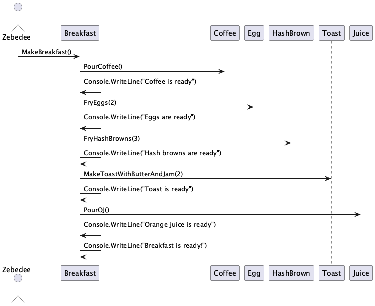
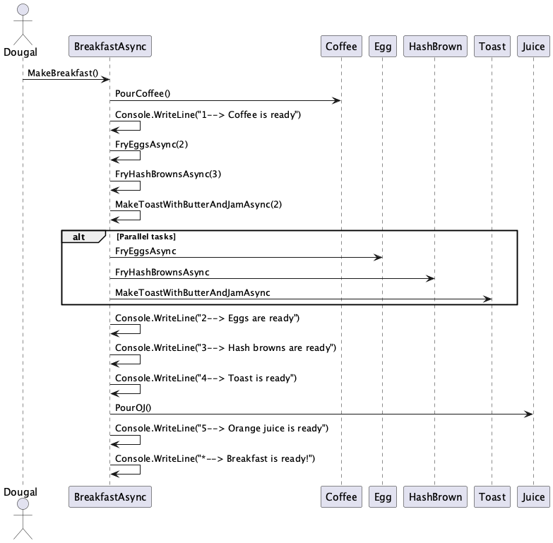

# Documentation for Asynchronous

### Breakfast

 

### Breakfast Asynchronous

### Async and Await Mindmap

### Async and Await generated podcast

Reference Material: [Async and Await on Microsoft learn](https://learn.microsoft.com/en-us/dotnet/csharp/asynchronous-programming/)